# Assessment Tests

### Test 1: Cluster Health

```bash
# All pods should be Running
kubectl get pods -n shopmicro
# Expected: All pods in Running state
```

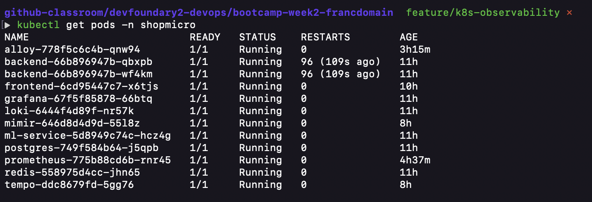

```bash
kubectl get deploy -n shopmicro
```

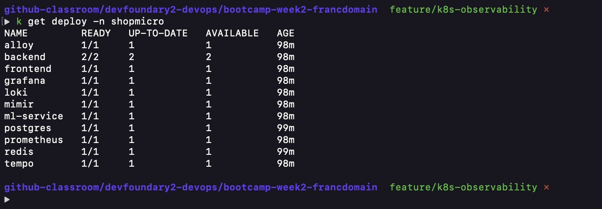

```bash
kubectl get svc -n shopmicro
```

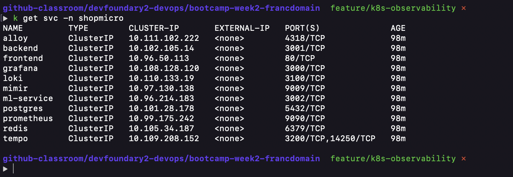

### Test 2: Service Connectivity

```bash
# Test backend health
curl http://localhost:3001/health
# Expected: {"status":"healthy","timestamp":"..."}
```

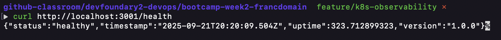

```bash
# Test frontend
curl http://localhost:8080
# Expected: HTML response
```

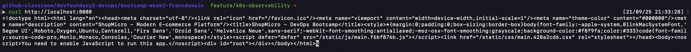

### Test 3: Metrics Collection

```bash
# Check backend metrics
curl http://localhost:3001/metrics | grep shopmicro_backend
# Expected: Prometheus metrics output
```

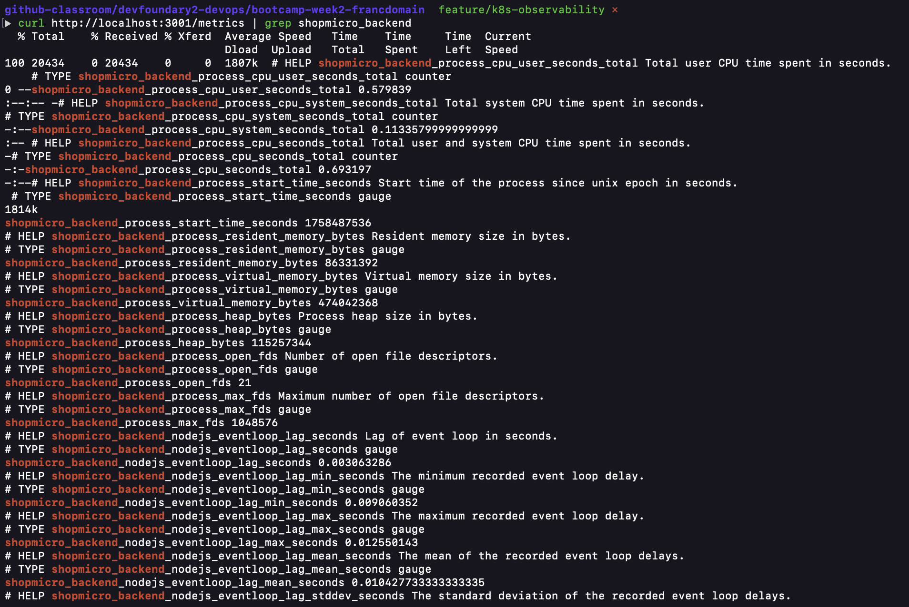

### Test 4: Grafana Dashboards

```bash
# Access Grafana
open http://localhost:3000
# Login: admin/admin
# Expected: Dashboards with data
```

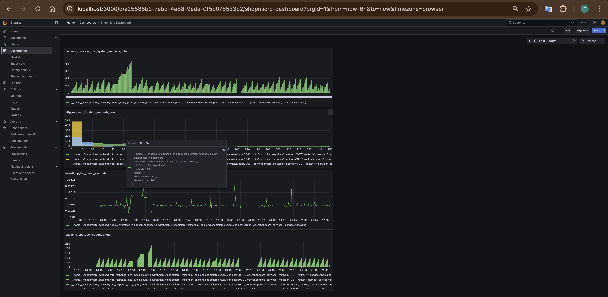

**Metrics**

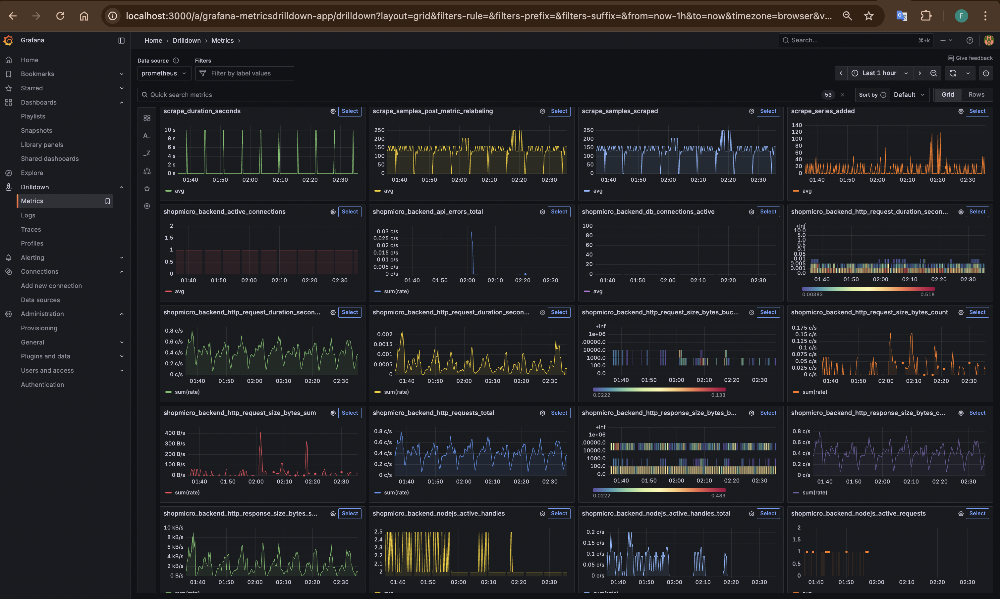

#### Prometheus UI

```bash
kubectl port-forward svc/prometheus -n shopmicro 9090:9090
```

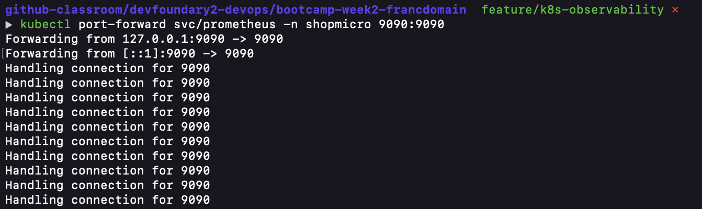


#### Frontend

```bash
kubectl port-forward svc/frontend -n shopmicro 8080:80
```

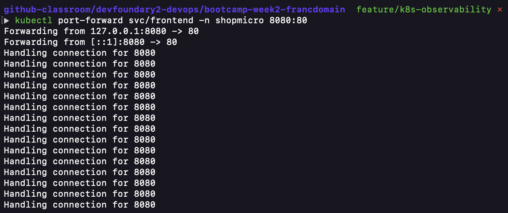
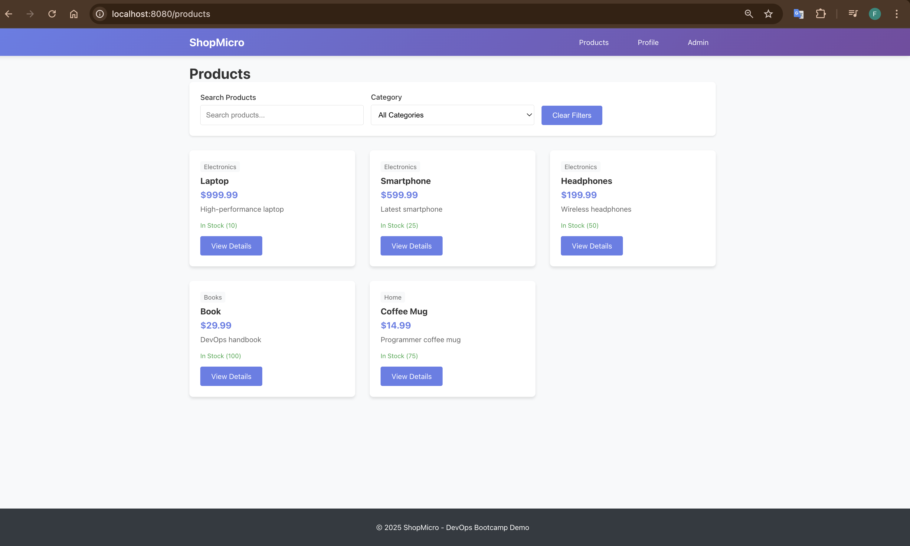
